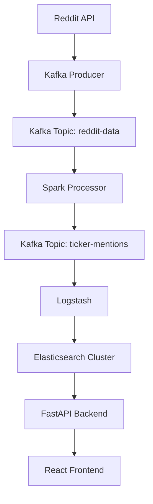

# WallStreetBuddy

**Live Application**: https://wsbuddy.app

A real-time financial sentiment analysis platform that monitors Reddit discussions about stocks, extracts ticker mentions, and provides AI-powered stock analysis through an interactive web dashboard.

## What WallStreetBuddy Does

WallStreetBuddy transforms Reddit financial discussions into actionable insights by:

1. **Real-time Data Collection**: Continuously monitors financial subreddits (r/stocks, r/wallstreetbets, r/ValueInvesting) for stock mentions
2. **Ticker Extraction**: Uses NLP to identify legitimate stock tickers from casual conversations, filtering out false positives
3. **Trend Analysis**: Tracks mention frequency across different time periods
4. AI-Powered Research: AI agent with specialized tools that leverage the yfinance API to generate comprehensive stock analysis reports every three days on the top ten most mentioned tickers. 
5. **Interactive Dashboard**: Provides a responsive web interface for exploring trending stocks, viewing mention history, and accessing analysis reports

### Core Components

#### Data Ingestion, Pipeline, and Processing
- **Reddit Producer**: Streams real-time comments and submissions from financial subreddits using PRAW
- **Apache Kafka**: Message streaming platform with topics for raw data (`reddit-data`) and processed data (`ticker-mentions`)
- **Spark Processor**: Real-time stream processing for ticker extraction using NLP and financial context analysis
- **Logstash**: ETL pipeline that consumes ticker mentions from Kafka and loads them into Elasticsearch indices

#### Data Storage 
- **3-Node Elasticsearch Cluster**: High-availability storage with automatic failover and load balancing

#### API & Frontend
- **FastAPI Backend**: RESTful API with async support, auto-documentation, and health monitoring
- **React Frontend**: Modern SPA with interactive charts, real-time updates, and responsive design
- **High Availability**: Both frontend and backend use multi-replica deployments with load balancing for zero-downtime operations
- **AI Analysis Agent**: Stock research agent with Yahoo Finance tools

## Pipeline Architecture

### Real-Time Processing Pipeline

**Data Flow Details:**

1. **Reddit Ingestion**: PRAW-based producer collects real-time comments and submissions
2. **Stream Processing**:
* Spark processes data with direct processing (no windowing) and 1-minute trigger intervals
* **Ticker Extraction**: NLP pipeline with:
   - Dollar pattern recognition (`$AAPL`)
   - Financial context scoring for ambiguous tickers
   - Company name resolution using SpaCy NER
   - SEC ticker validation
4. **Data Storage**: Processed data stored in time-series Elasticsearch indices
5. **API Access**: FastAPI provides RESTful endpoints for querying ticker data and analytics

#### Service Communication
- **Internal**: Kubernetes DNS-based service discovery
- **External**: GCE ingress with path-based routing (`/api/*` vs `/*`)
- **API Security**: Internal API keys for service-to-service communication

#### High Availability Features
- **Node Failure Tolerance**: Elasticsearch cluster maintains quorum with any single node failure
- **Automatic Failover**: Master election and request routing handled automatically
- **Load Distribution**: Traffic distributed across multiple replicas via LoadBalancer
- **Zero Downtime Updates**: Rolling deployments with health check validation

## Future Enhancements
- **Sentiment Analysis**: Train a Small Language Model (SLM) using gathered Reddit data to classify sentiment for each stock mention, then aggregate individual message sentiment scores to generate overall stock sentiment metrics 
